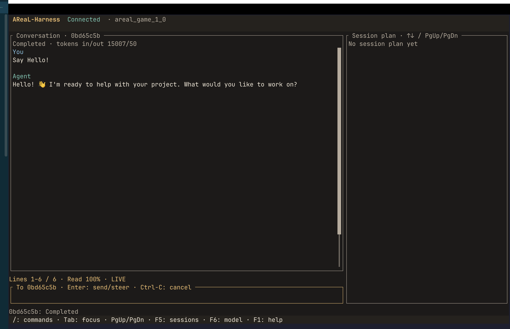

**中文** | [English](README.en.md)

  
  <h1>AReaL-Harness</h1>
  
<strong>面向工具执行与多 Agent 协作的模块化框架</strong>

  
可组合 Core · 独立 Runtime · 持久会话

  

    
    
    
  

  
<a href="docs/guides/quickstart.md">快速开始</a> · <a href="docs/features.md">能力与边界</a> · <a href="docs/README.md">文档</a> · <a href="CONTRIBUTING.md">参与贡献</a>

## 🎯 Focus On

- **Multi-Agent**：通过 Agent 委派与 Workgroup 拆分任务、协调依赖、汇总结果。
- **Unlimited Context**：通过上下文压缩与检查点延续会话，同时保留原始历史。
- **Long-Horizon Tasks**：围绕持久会话、任务计划与恢复机制，推进多阶段工作。
- **Efficient Execution**：基于 Rust + Tokio 异步执行与分层并发控制，追求高吞吐、低运行时开销。

已实现范围与限制集中维护在[当前能力与边界](docs/features.md)。

## 🖥️ TUI

详情见[客户端指南](docs/guides/clients.md)。

## 🌐 WebUI

**Coming Soon**

## 🚀 从这里开始

> [!NOTE]
> 项目处于开发阶段，目前从源码构建使用。完整本地工具链面向 macOS 可信宿主；Linux 工具执行限受控 Docker 环境，尚未提供通用生产 Linux 或 Windows 原生 Runtime。TypeScript SDK 尚未发布到 npm。

第一次使用，跟随[快速开始](docs/guides/quickstart.md)完成构建、无 API 密钥验证和第一次模型会话；随后按需选择下面的指南。

| 你想做什么 | 阅读文档 |
|---|---|
| 在终端中使用 | [CLI 与 TUI](docs/guides/clients.md) |
| 配置模型、凭据与执行权限 | [配置](docs/guides/configuration.md) · [Runtime 部署](docs/guides/runtime.md) |
| 接入工具与可复用指令 | [工具与 hooks](docs/guides/tools.md) · [MCP](docs/guides/mcp.md) · [Skills](docs/guides/skills.md) |
| 组织多 Agent 协作 | [Agent 委派](docs/design/multi-agent.md) · [Workgroup 使用](docs/guides/workgroups.md) |
| 集成到自己的应用 | [Core API](docs/api/core.md) · [Runtime API](docs/api/runtime.md) · [TypeScript SDK](docs/api/typescript-sdk.md) · [示例](docs/examples/desktop-api.md) |
| 理解实现与参与开发 | [架构与目录](docs/design/architecture.md) · [开发指南](docs/development/README.md) |
| 运行评测与理解结果 | [基准测试](docs/benchmarks/README.md) · [统计方法](docs/benchmarks/methodology.md) |

浏览[完整文档目录](docs/README.md)，或阅读[安全说明](SECURITY.md)了解信任边界与漏洞反馈方式。

## 🤝 参与贡献

欢迎试用、[报告问题](https://github.com/areal-project/AReaL-Harness/issues)和提交改进。开始前请阅读[贡献指南](CONTRIBUTING.md)。

## 致谢与许可证

使用 [cordis-rs](https://github.com/dshbox/cordis-rs) 组件，参考 Codex 协议和 DeepSeek Harness 插件接口；来源见 [upstream/pins.json](upstream/pins.json)。

**许可证：** [Apache-2.0](LICENSE)。第三方材料保留各自的许可证与版权声明。
